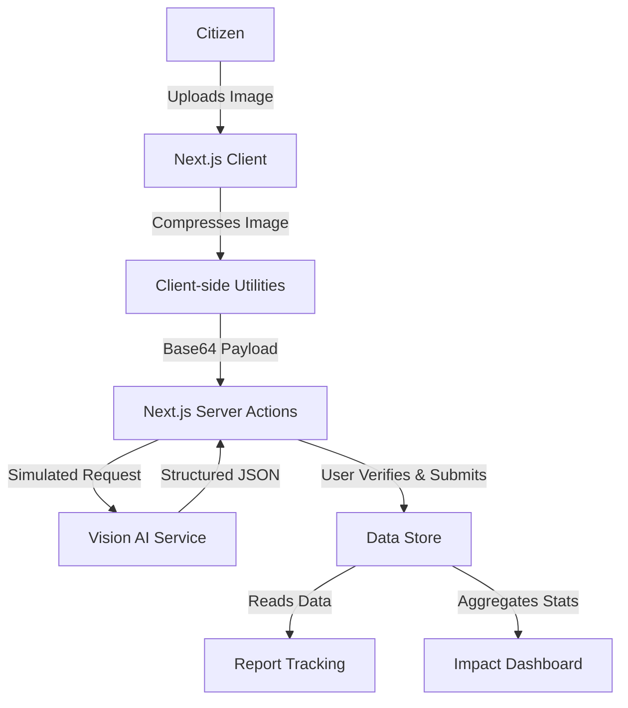

# Architecture

The following diagram illustrates the architecture of CivicFix as implemented in the current MVP.

### Components Used:
- **Next.js Client**: Handles UI, drag-and-drop, and location tracking.
- **Client-side Utilities**: Canvas API used to compress images locally (max 1600px, WebP) to optimize upload payloads.
- **Next.js Server Actions**: Secure backend functions that process the image and handle database operations.
- **Vision AI Service**: Analyzes the image and returns a strictly typed JSON object (category, severity, description). *(Note: Simulated in the MVP environment for hackathon reliability)*.
- **Data Store**: Manages persistent state for the reports, generating unique `CF-XXXXX` tracking IDs.
