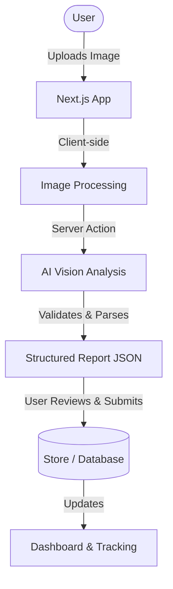

# CivicFix

> Spot it. Report it. Fix it.

## Problem

People see problems in their neighborhoods such as garbage dumping, potholes, broken streetlights, damaged roads, or blocked drains every day. However, reporting them is often slow, confusing, and poorly structured. Citizens often do not know which department to contact or how to formally categorize and describe the issue, leading to a high barrier to entry for civic engagement.

## Solution

CivicFix reduces the friction between observation and actionable reporting. Instead of forcing citizens to navigate complex municipal forms, CivicFix allows a user to photograph a civic problem and automatically turn it into a structured report using AI. 

## Core Flow

```text
Photo
→ AI Analysis
→ User Verification
→ Location
→ Report
→ Tracking
```

## Features

* **AI-powered issue detection**: Instantly identify the type of civic problem from an image.
* **Severity classification**: AI automatically determines the urgency of the issue (e.g., Low, Medium, High).
* **AI-generated report descriptions**: Professional descriptions and recommended actions are auto-generated.
* **User verification/editing**: Users retain full control to review and modify AI-generated details before submission.
* **Location tagging**: Attach precise coordinates or manual location text to the report.
* **Report tracking**: Real-time status tracking via unique identifiers (`CF-XXXXX`).
* **Community impact dashboard**: A beautiful, transparent view into neighborhood issues and resolution statistics.

## Technology

* Next.js 14 (App Router)
* React
* Tailwind CSS
* shadcn/ui
* TypeScript
* Vercel

## Architecture



## Getting Started

### Installation

Clone the repository and install dependencies:

```bash
git clone https://github.com/manav-gupta1/CivicFix.git
cd CivicFix
npm install
```

### Environment Variables

Create a `.env.local` file in the root directory. 
*(Note: The current MVP utilizes an in-memory mock store and mock AI response for instant hackathon demonstrations without requiring backend keys. For a production backend, configure the following:)*

```text
NEXT_PUBLIC_SUPABASE_URL=your_supabase_url
NEXT_PUBLIC_SUPABASE_ANON_KEY=your_supabase_anon_key
SUPABASE_SERVICE_ROLE_KEY=your_service_role_key
AI_API_KEY=your_ai_api_key
```

### Development

Run the local development server:

```bash
npm run dev
```

Open [http://localhost:3000](http://localhost:3000) with your browser to see the result.

### Production Build

```bash
npm run build
npm start
```

## Deployment

The application is deployed on Vercel and can be accessed at:
**[https://civicfix-demo.vercel.app](https://civicfix-demo.vercel.app)**
